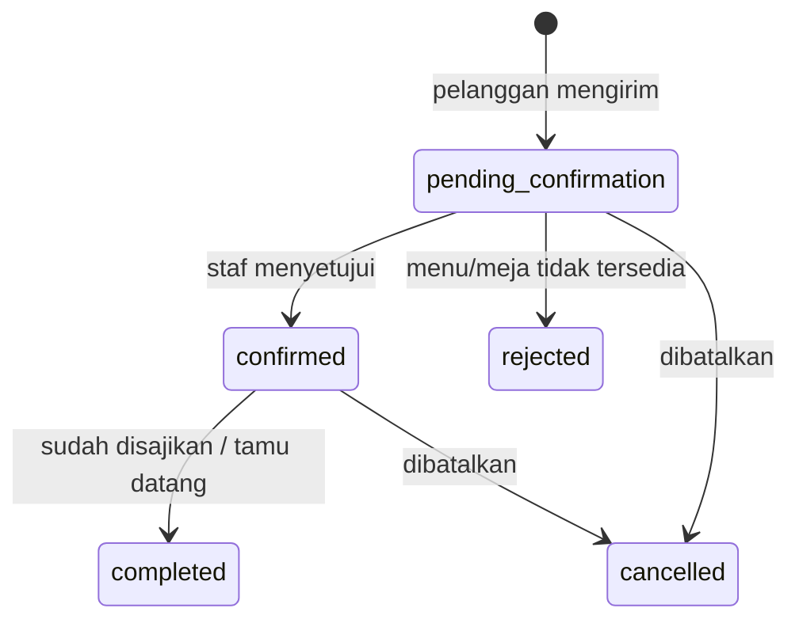

# Website Restoran Rahmawati

Website Restoran Rahmawati adalah proyek frontend untuk memperkenalkan restoran, menampilkan menu, menerima pesanan, dan membantu pelanggan mengajukan reservasi meja.

Proyek menggunakan React, TypeScript, dan Vite. Versi MVP dibuat tanpa backend. Pesanan serta reservasi akan disusun oleh website lalu dikirim ke WhatsApp restoran untuk dikonfirmasi secara manual.

## Fitur Utama

- Landing page pemasaran restoran.
- Katalog menu dengan kategori dan pencarian.
- Detail menu, pilihan varian, jumlah, dan catatan.
- Pemesanan dari QR unik yang tersedia di setiap meja.
- Nomor meja terisi otomatis dari QR atau dapat dimasukkan manual.
- Keranjang belanja.
- Checkout dengan pembayaran cash atau transfer manual.
- Ringkasan pesanan yang dikirim ke WhatsApp.
- Form reservasi meja yang dikirim ke WhatsApp.
- Informasi lokasi, jam operasional, promo, dan kontak.
- Tampilan responsif untuk mobile, tablet, dan desktop.

## Struktur Halaman

| Halaman | Fungsi |
| --- | --- |
| `/` | Landing page, menu unggulan, promo, galeri, lokasi, dan informasi restoran |
| `/menu?table=:nomor` | Katalog, pencarian, kategori, pemilihan menu, dan identitas meja dari QR |
| `/detail-menu?id=:menu` | Detail menu, varian, jumlah, dan catatan. Dari keranjang dibuka dengan `?edit=:item` untuk mengubah pilihan |
| `/cart` | Mengelola produk yang akan dipesan |
| `/checkout` | Data pelanggan, metode pembayaran, dan pengiriman pesanan ke WhatsApp |
| `/reservasi` | Form dan pengiriman permintaan reservasi meja |

## Alur Pemesanan

```text
Scan QR meja atau masukkan nomor meja
  -> Nomor meja dikonfirmasi
  -> Pilih menu
  -> Atur varian dan jumlah
  -> Masukkan ke keranjang
  -> Isi data checkout
  -> Pilih cash atau transfer manual
  -> Kirim ringkasan ke WhatsApp
  -> Menunggu konfirmasi restoran
```

## Alur Reservasi

```text
Pilih tanggal, jam, dan jumlah tamu
  -> Isi data pelanggan
  -> Periksa ringkasan
  -> Kirim ke WhatsApp
  -> Menunggu konfirmasi restoran
```

## Batasan MVP

Karena proyek masih frontend-only, website belum memiliki:

- Database atau dashboard admin.
- Ketersediaan menu dan meja secara realtime.
- Verifikasi pembayaran otomatis.
- Upload bukti transfer.
- Payment gateway.
- Pesanan delivery dan perhitungan ongkir otomatis.

Konfirmasi ketersediaan, pembayaran, pesanan, dan reservasi dilakukan oleh staf restoran melalui WhatsApp.

QR hanya membantu mengisi nomor meja. Karena belum ada backend, sistem belum dapat membuktikan bahwa pelanggan benar-benar berada di meja tersebut atau mencegah perubahan nomor meja melalui URL. Nomor meja akan selalu ditampilkan kembali pada checkout agar dapat diperiksa pelanggan.

## Tahapan Pengerjaan

1. Menyiapkan identitas visual, konten, foto, dan data menu.
2. Membuat fondasi proyek dan design system.
3. Membangun landing page.
4. Membangun katalog, detail menu, dan identifikasi meja melalui QR.
5. Membangun keranjang dan checkout.
6. Membangun form reservasi.
7. Melakukan pengujian responsif, aksesibilitas, dan production build.

Estimasi pengerjaan MVP adalah 7 sampai 9 hari kerja jika seluruh konten dan aset sudah tersedia. Estimasi ini sudah mencakup integrasi dan pengujian QR meja.

## Plan Lengkap

Penjelasan lengkap mengenai scope, arsitektur, komponen, model data, validasi, tahapan implementasi, kebutuhan aset, dan kriteria penerimaan tersedia di:

**[Baca Frontend Plan Lengkap](./FRONTEND_PLAN.md)**

Usulan kebutuhan backend (endpoint API, rancangan database, dan validasi) tersedia di bagian **[Spesifikasi Backend](#spesifikasi-backend)**.

## Menjalankan Proyek

```bash
npm install
npm run dev
```

Pemeriksaan sebelum publikasi:

```bash
npm run lint
npm run build
```

## Spesifikasi Backend

### Ringkasan

Saat ini website Restoran Rahmawati belum mengambil data dari API. Semua data contoh (menu, harga, jam buka, dan lainnya) masih ditulis langsung di kode frontend, yaitu di folder `src/data`. Isi keranjang disimpan sementara di browser menggunakan `sessionStorage`.

Hal ini memang sesuai rencana awal di `FRONTEND_PLAN.md`: tahap pertama (MVP) dibuat tanpa backend, database, login, dan pembayaran online. Pesanan dan reservasi hanya disusun menjadi pesan WhatsApp, lalu dikonfirmasi manual oleh staf restoran.

Bagian ini kami susun sebagai usulan untuk tim backend. Isinya diambil dari kode frontend yang sudah selesai (repository `Rahmadarf/restoran-rahmawati`, PR #4), supaya bentuk data dari backend nanti langsung cocok dengan tampilan website.

Kami mengusulkan backend dikerjakan dalam tiga tahap:

| Tahap | Yang dikerjakan | Pesanan dan reservasi |
| --- | --- | --- |
| A. Katalog | Menu, harga, status habis, dan info restoran bisa diatur dari halaman admin | Masih lewat WhatsApp dan dikonfirmasi manual |
| B. Transaksi | Tahap A, ditambah pesanan dan reservasi disimpan di database beserta statusnya | WhatsApp dipakai sebagai pemberitahuan; staf mengubah status dari dashboard admin |
| C. Lanjutan | Tahap B, ditambah QR meja yang aman, slot reservasi, dan bukti transfer | Sama seperti tahap B |

Menurut kami, sebaiknya tahap A diselesaikan terlebih dahulu, baru dilanjutkan ke tahap B.

#### Istilah yang dipakai

| Istilah | Artinya |
| --- | --- |
| API | Jalur komunikasi antara website (frontend) dan server (backend) |
| Endpoint | Alamat API untuk satu tugas, misalnya `GET /api/v1/menu` untuk mengambil daftar menu |
| GET / POST / PUT / PATCH / DELETE | Jenis permintaan: mengambil, mengirim data baru, mengganti, mengubah sebagian, dan menghapus data |
| JSON | Format teks untuk bertukar data antara frontend dan backend |
| Request / response | Data yang dikirim frontend / data balasan dari backend |
| Validasi | Pengecekan apakah isian form sudah benar |
| Token | Kode acak rahasia sebagai tanda izin akses |

### Siapa yang menentukan nama route

Ada dua jenis route yang berbeda. Route halaman diatur oleh frontend, sedangkan endpoint API dibuat oleh backend dengan nama yang disepakati bersama.

| Jenis | Contoh | Yang mengatur | Keterangan |
| --- | --- | --- | --- |
| Route halaman (alamat yang dibuka pelanggan) | `/menu`, `/detail-menu?id=ayam`, `/cart`, `/checkout`, `/reservasi` | Frontend (React Router) | Sudah dibuat. Backend tidak perlu mengubahnya. Jika website dan API berada di server yang sama, semua alamat selain `/api` perlu diarahkan ke `index.html`. |
| Alamat QR meja | `/menu?table=12` | Frontend | Alamat ini dicetak di meja, jadi sebaiknya tidak diubah agar QR tidak perlu dicetak ulang. |
| Endpoint API | `GET /api/v1/menu`, `POST /api/v1/orders` | Dibuat backend, namanya disepakati bersama | Nama di bagian ini masih usulan. Tim backend boleh menyesuaikan dengan kebiasaan framework yang dipakai. |

Langkah kerja yang kami usulkan:

1. Tim backend membaca daftar endpoint di bagian ini, lalu memberi masukan jika ada nama atau bentuk data yang ingin diubah.
2. Tim frontend dan backend menyepakati daftar akhirnya. Akan lebih baik jika ditulis dalam file dokumentasi API (misalnya OpenAPI/Swagger).
3. Setelah disepakati, tim backend yang menjaga daftar tersebut. Jika ada perubahan, mohon diinformasikan ke tim frontend sebelum diterapkan.
4. Selama backend belum siap, frontend tetap bisa bekerja memakai data contoh dengan bentuk JSON yang sama.

### Aturan API yang perlu disepakati

Sebelum endpoint mulai dibuat, ada tujuh hal yang perlu disepakati bersama. Kolom Usulan berisi pilihan dari kami yang masih bisa didiskusikan.

| Keputusan | Usulan | Alasan |
| --- | --- | --- |
| Base URL & versi | `/api/v1/...` | Dengan nomor versi, perubahan besar di masa depan tidak langsung merusak website yang sudah berjalan. |
| Penamaan field JSON | camelCase (`customerName`) | Sama dengan penamaan di kode TypeScript frontend. Jika backend terbiasa memakai snake_case (seperti di Laravel), salah satu pihak perlu menyesuaikan. Mohon dipilih salah satu. |
| Uang | integer rupiah (`32000`) | Frontend sudah memakai bilangan bulat, sehingga tidak ada masalah pembulatan angka desimal. |
| Tanggal & jam | `YYYY-MM-DD` dan `HH:MM`, zona Asia/Jakarta | Formatnya sama dengan nilai dari `input[type=date]` dan `input[type=time]` di form. |
| Error validasi | HTTP 422 + `errors` per field (contoh di bawah) | Dengan nama field yang sama, pesan kesalahan bisa langsung ditampilkan di bawah kolom form yang salah. |
| Autentikasi admin | Token (Bearer) atau session cookie | Endpoint untuk pelanggan tidak memerlukan login, sedangkan semua endpoint `/admin` wajib login. |
| Domain & CORS | Satu domain, `/api` diteruskan ke backend | Jika satu domain, tidak perlu pengaturan CORS. Jika domain berbeda, backend perlu mengizinkan alamat website. Saat pengembangan, Vite bisa meneruskan `/api` ke backend melalui `server.proxy`. |

Contoh balasan dari backend ketika isian form tidak valid (kode HTTP 422):

```json
{
  "message": "Ada 2 kolom yang perlu diperiksa.",
  "errors": {
    "whatsapp": "Gunakan nomor WhatsApp valid, misalnya 081234567890.",
    "tableCode": "Masukkan nomor meja bulat 1–50."
  }
}
```

Kode HTTP lain yang kami usulkan: 404 jika data tidak ditemukan, 409 jika menu sudah habis saat checkout, dan 429 jika terlalu banyak permintaan dalam waktu singkat.

### Data contoh yang nanti diambil dari backend

Tabel berikut menunjukkan letak data contoh di kode frontend saat ini, dan ke mana data tersebut sebaiknya dipindahkan di backend.

| Data | Lokasi sekarang di frontend | Rencana di backend |
| --- | --- | --- |
| Daftar menu (8 item) | `src/data/menu.ts` (`MENU`) | Tabel `menu_items` |
| Menu favorit dan 3 menu terlaris di Beranda | `menu.ts` (`FAVORITE_IDS`, `FEATURED_IDS`) | Kolom `is_favorite` dan `featured_order` |
| Kategori | `src/data/categories.ts` | Tabel `categories`. Catatan: "Semua" dan "Favorit" hanya filter di frontend, bukan kategori |
| Varian, level pedas, tambahan, dan harganya | `src/data/options.ts` | Tabel `menu_variants`, `menu_extras`, `spice_levels` |
| Info restoran (alamat, jam, meja 1–50, maksimal 99 porsi) | `src/data/restaurant.ts` | Tabel `settings` |
| Status "Buka · contoh" | Ditulis langsung di `OutletHeader.tsx` | Dihitung oleh server dari jam buka |
| Rekening `0000000000` | `PaymentMethodSelector.tsx` | Tabel `payment_accounts` |
| Nomor WhatsApp resmi | Belum ada | `settings.whatsapp_number` |
| Harga dan isi Paket Keluarga di Beranda | Ditulis ulang di `FamilySection.tsx` (sama dengan data di `menu.ts`) | Diambil dari menu `keluarga` |
| Testimoni dan galeri | Ditulis langsung di `GallerySection.tsx` | Opsional, bisa diatur dari admin |
| Jam reservasi (10.00–20.00 setiap 30 menit), area, keperluan, maksimal 30 tamu | `ReservationPage.tsx`, `validation.ts` | Tabel `settings` dan endpoint ketersediaan |
| Isi keranjang | `sessionStorage` (`rahmawati-cart-v2`) | Tetap di browser, baru dikirim ke server saat checkout |
| Nomor meja, pilihan bawa pulang, catatan umum | `sessionStorage` (`rahmawati-table`, `rahmawati-general-note`) | Tetap di browser, ikut dikirim saat checkout |

### Rancangan tabel database

Kami mengusulkan 16 tabel untuk tahap A sampai C. Semua nilai uang disimpan sebagai bilangan bulat dalam rupiah.

| Tabel | Kolom utama | Tahap |
| --- | --- | --- |
| `categories` | id, slug, name, sort_order | A |
| `menu_items` | id, slug (`ayam`), name, description, price, image_url, category_id, badge (`Pedas` / `Baru` / `Paket hemat` / kosong), is_available, is_favorite, featured_order, has_spice_levels, sort_order | A |
| `menu_variants` | id, menu_item_id, name (`Paha`), price_delta (0 / 8000), sort_order | A |
| `menu_extras` | id, menu_item_id, name (`Nasi putih`), price (6000), sort_order | A |
| `spice_levels` | id, name (`Tidak pedas` / `Sedang` / `Pedas`), sort_order | A |
| `settings` | name, address, maps_url, whatsapp_number, last_order_time, max_qty_per_item (99), max_guests (30), timezone | A |
| `opening_hours` | day_of_week, open_time, close_time, is_closed | A |
| `admin_users` | id, name, email, password_hash, role | A |
| `dining_tables` | id, code (`12` / `A12`), area, capacity, qr_token, is_active | B/C |
| `payment_accounts` | bank_name, account_number, account_holder, is_active | B |
| `orders` | id, code (`RHM-260917-0012`), access_token, customer_name, whatsapp, order_type (`dine_in` / `takeaway`), table_id, order_time (`asap` / `scheduled`), scheduled_time, note, payment_method (`cash` / `transfer`), subtotal, extra_fee, total, status, payment_status, created_at | B |
| `order_items` | id, order_id, menu_item_id, name_snapshot, variant_name_snapshot, spice_level, unit_price_snapshot, qty, note | B |
| `order_item_extras` | order_item_id, extra_name_snapshot, price_snapshot | B |
| `reservation_areas` | id, name (`Indoor` / `Teras` / `Bebas`), capacity | B |
| `reservations` | id, code, access_token, customer_name, whatsapp, date, time, guest_count, area_id, purpose, note, status, created_at | B |
| `reservation_slots` | date atau day_of_week, time, max_tables | C |

Beberapa catatan dari kami:

- **Harga disimpan ulang di pesanan** (kolom `_snapshot`). Tujuannya agar pesanan lama tetap tercatat dengan harga saat dipesan, walaupun harga menu berubah.
- **Status habis cukup satu kolom**, yaitu `is_available`. Di frontend sekarang ada dua penanda (`sold: true` dan badge `Habis`), dan label "Habis" bisa dibuat dari kolom ini.
- **Level pedas tidak berlaku untuk semua menu.** Contohnya Es Teh, jadi perlu kolom `has_spice_levels`.
- **Varian dan tambahan perlu ID yang tetap.** Penjelasannya ada di bagian Perubahan di frontend.

### Endpoint untuk pelanggan

Ada 11 endpoint yang dipakai pelanggan tanpa perlu login. Semua alamat diawali `/api/v1`.

| Method | Alamat | Kegunaan | Dipakai di halaman | Tahap |
| --- | --- | --- | --- | --- |
| GET | `/restaurant` | Mengambil info restoran, jam buka, status buka, nomor WhatsApp, dan batas-batas | Header outlet, footer, lokasi, validasi | A |
| GET | `/categories` | Mengambil daftar kategori | Tab kategori di Menu | A |
| GET | `/menu` | Mengambil semua menu beserta tanda favorit dan terlaris | Beranda, Menu | A |
| GET | `/menu/{slug}` | Mengambil satu menu beserta varian, level pedas, dan tambahan | Detail Menu | A |
| POST | `/cart/quote` | Menghitung ulang harga dan mengecek menu yang habis sebelum checkout | Keranjang, Checkout | B |
| POST | `/orders` | Menyimpan pesanan | Checkout | B |
| GET | `/orders/{code}?token=` | Melihat status pesanan | Setelah pesanan dikirim | B |
| GET | `/reservations/availability?date=&guests=` | Melihat jam reservasi yang masih tersedia | Reservasi | B/C |
| POST | `/reservations` | Menyimpan reservasi | Reservasi | B |
| GET | `/reservations/{code}?token=` | Melihat status reservasi | Setelah reservasi dikirim | B |
| GET | `/tables/resolve?token=` | Mengubah kode QR menjadi nomor meja | Menu (setelah scan QR) | C |

#### Contoh: GET /menu/{slug}

Bentuk data ini mengikuti yang dibutuhkan halaman Detail Menu:

```json
{
  "id": "nasi",
  "name": "Nasi Goreng Kampung",
  "description": "Nasi goreng bumbu rumahan, telur, ayam suwir, dan kerupuk.",
  "price": 28000,
  "imageUrl": "https://cdn.example.com/menu/nasi-goreng.jpg",
  "category": { "slug": "nasi-mi", "name": "Nasi & Mi" },
  "badge": null,
  "isAvailable": true,
  "isFavorite": true,
  "variants": [
    { "id": "v_kampung", "name": "Kampung", "priceDelta": 0 },
    { "id": "v_spesial", "name": "Spesial + bakso", "priceDelta": 8000 }
  ],
  "spiceLevels": ["Tidak pedas", "Sedang", "Pedas"],
  "extras": [
    { "id": "e_telur", "name": "Telur ceplok", "price": 5000 },
    { "id": "e_ayam", "name": "Ayam ekstra", "price": 8000 }
  ]
}
```

#### Contoh: GET /restaurant

```json
{
  "name": "Restoran Rahmawati",
  "address": "Jl. Melati No. 12, Bandung, Jawa Barat",
  "mapsUrl": "https://www.google.com/maps/search/?api=1&query=Restoran%20Rahmawati",
  "whatsappNumber": "6281234567890",
  "hours": { "open": "10:00", "close": "21:00", "lastOrder": "20:30" },
  "isOpen": true,
  "limits": { "maxQtyPerItem": 99, "maxGuests": 30, "noteMaxLength": 300 }
}
```

#### Contoh: POST /orders

Data yang dikirim frontend (diambil dari isian form Checkout):

```json
{
  "customerName": "Dina Pratiwi",
  "whatsapp": "081234567890",
  "orderType": "dine_in",
  "tableCode": "12",
  "orderTime": "asap",
  "scheduledTime": null,
  "paymentMethod": "cash",
  "note": "Sajikan semua menu bersamaan.",
  "items": [
    { "menuItemId": "ayam", "variantId": "v_paha", "spiceLevel": "Sedang",
      "extraIds": ["e_nasi_putih"], "qty": 2, "note": "Sambal dipisah, ya." },
    { "menuItemId": "teh", "variantId": "v_tawar", "spiceLevel": null,
      "extraIds": [], "qty": 2, "note": "" }
  ]
}
```

Balasan dari backend (kode HTTP 201):

```json
{
  "code": "RHM-260917-0012",
  "accessToken": "q8Zk3v...",
  "status": "pending_confirmation",
  "subtotal": 92000,
  "extraFee": 0,
  "total": 92000,
  "whatsappUrl": "https://wa.me/6281234567890?text=PERMINTAAN%20PESANAN..."
}
```

Mohon diperhatikan saat membuat endpoint pesanan:

- **Harga yang dikirim browser sebaiknya tidak dipakai.** Server perlu menghitung ulang: harga menu + tambahan harga varian + harga semua tambahan, lalu dikali jumlah porsi. Contoh: (32.000 + 6.000) × 2 + 8.000 × 2 = **Rp92.000**.
- **Menu yang sudah habis ditolak** dengan kode HTTP 409.
- **Status awal selalu `pending_confirmation`** (menunggu konfirmasi). Status "berhasil" tidak boleh muncul sebelum staf restoran mengonfirmasi.

#### Contoh: POST /reservations

```json
{
  "customerName": "Dina Pratiwi",
  "whatsapp": "081234567890",
  "date": "2026-09-18",
  "time": "18:30",
  "guestCount": 4,
  "area": "Indoor",
  "purpose": "Makan bersama",
  "note": "Mohon sediakan satu kursi anak."
}
```

Balasannya sama seperti pesanan, berisi `code`, `accessToken`, `status: "pending_confirmation"`, dan `whatsappUrl`.

### Validasi di server

Saat ini pengecekan isian form hanya dilakukan di browser (`src/lib/validation.ts`). Pengecekan di browser mudah dilewati, jadi kami mohon aturan yang sama juga diterapkan di server, dengan pesan yang sama.

Catatan: nama field di form frontend sedikit berbeda dengan nama di data yang dikirim ke server (`name` → `customerName`, `table` → `tableCode`, `guests` → `guestCount`, `pickupTime` → `scheduledTime`). Kami usulkan balasan error memakai nama yang dikirim ke server, lalu frontend yang menyesuaikan.

| Field | Aturan | Pesan kesalahan |
| --- | --- | --- |
| Nama | Wajib diisi, maksimal 80 karakter | Kolom ini wajib diisi. |
| Nomor WhatsApp | Hapus spasi, `(`, `)`, dan `-`, lalu cocokkan dengan pola `^(?:\+62\|62\|08)\d{7,12}$` | Gunakan nomor WhatsApp valid, misalnya 081234567890. |
| Nomor meja (makan di tempat) | Wajib diisi dan harus terdaftar di tabel `dining_tables` (sekarang angka 1–50) | Masukkan nomor meja bulat 1–50. |
| Jam ambil (jika memilih waktu) | Wajib diisi, antara 10:00–20:30, dan belum lewat | Pilih waktu antara 10.00–20.30 WIB. / Waktu hari ini sudah lewat. Pilih waktu yang akan datang. |
| Jumlah porsi per menu | Bilangan bulat 1–99 | — |
| Catatan (item, umum, reservasi) | Maksimal 300 karakter | — |
| Tanggal reservasi | Wajib diisi, tidak boleh sebelum hari ini | Tanggal sudah lewat. Pilih hari ini atau sesudahnya. |
| Jam reservasi | Wajib diisi dan termasuk jam yang tersedia; jika tanggalnya hari ini, jamnya belum lewat | Jam sudah lewat. Pilih jam berikutnya atau tanggal lain. |
| Jumlah tamu | Bilangan bulat 1–30 | Jumlah tamu harus 1–30 orang. |
| Area meja | Wajib dipilih: `Indoor`, `Teras`, atau `Bebas` | Kolom ini wajib diisi. |

Pengecekan tanggal dan jam di server sebaiknya memakai zona waktu `Asia/Jakarta` (WIB). Frontend sekarang memakai jam di perangkat pelanggan, yang belum tentu tepat.

### Endpoint untuk admin

Endpoint berikut hanya boleh dipakai staf yang sudah login. Semua alamat diawali `/api/v1/admin`.

| Method | Alamat | Kegunaan | Tahap |
| --- | --- | --- | --- |
| POST | `/auth/login`, `/auth/logout` | Login dan logout staf | A |
| GET, POST | `/menu` | Melihat daftar menu dan menambah menu | A |
| GET, PUT, DELETE | `/menu/{id}` | Melihat, mengubah, dan menghapus menu | A |
| PATCH | `/menu/{id}/availability` | Menandai menu habis atau tersedia (paling sering dipakai) | A |
| GET, POST, PUT, DELETE | `/menu/{id}/variants`, `/menu/{id}/extras` | Mengatur varian dan tambahan | A |
| GET, POST, PUT, DELETE | `/categories` | Mengatur kategori | A |
| POST | `/uploads/images` | Mengunggah foto menu, balasannya berisi `imageUrl` | A |
| GET, PUT | `/settings` | Mengatur jam buka, nomor WhatsApp, alamat, dan batas | A |
| GET, POST, PUT, DELETE | `/tables` | Mengatur daftar meja | B |
| POST | `/tables/{id}/qr` | Membuat ulang kode dan gambar QR meja | C |
| GET | `/orders?status=&date=` | Melihat daftar pesanan yang masuk | B |
| PATCH | `/orders/{id}/status` | Mengubah status pesanan | B |
| PATCH | `/orders/{id}/payment-status` | Mengubah status pembayaran: `unpaid`, `awaiting_transfer`, `paid` | B |
| GET | `/reservations?date=&status=` | Melihat daftar reservasi | B |
| PATCH | `/reservations/{id}/status` | Mengubah status reservasi | B |

Alur status pesanan (reservasi juga memakai status yang sama):



Selama status belum `confirmed`, pelanggan hanya melihat keterangan "menunggu konfirmasi".

### Keamanan dan WhatsApp

Karena website saat ini belum punya server, ada enam risiko yang belum tertangani. Berikut usulan penanganannya di backend.

| Risiko | Kondisi sekarang | Usulan penanganan | Tahap |
| --- | --- | --- | --- |
| Nomor meja bisa dipalsukan | Alamat `?table=12` bisa diketik siapa saja (sudah dicatat di `FRONTEND_PLAN.md`) | QR berisi kode acak, misalnya `/menu?t=Xk29...`. Frontend memanggil `GET /api/v1/tables/resolve?token=` untuk mendapat nomor meja | C |
| Status pesanan dilihat orang lain | Kode pesanan `RHM-...` mudah ditebak | Backend memberikan `accessToken` acak saat pesanan dibuat, dan token ini wajib dikirim saat melihat status | B |
| Pesanan atau reservasi palsu (spam) | Endpoint bisa dipakai tanpa login | Batasi jumlah permintaan per alamat IP dan per nomor WhatsApp (balas kode 429) | B |
| Data pribadi pelanggan | Rencana awal menyebut nama dan nomor WhatsApp tidak disimpan | Tentukan berapa lama data disimpan, dan tampilkan pemberitahuan singkat di form | B |
| Nomor rekening terlihat semua orang | Rekening contoh langsung tampil saat memilih transfer | Rekening asli baru dikirim setelah pesanan berstatus `confirmed` | B |
| Harga diubah dari browser | Total dihitung di browser | Server menghitung ulang total dari ID menu, varian, dan tambahan | B |

Pilihan untuk menghubungkan WhatsApp:

- **Link `wa.me` (kami sarankan, gratis):** server menyusun teks pesan dan mengirim `whatsappUrl`, lalu pelanggan menekan tombol kirim sendiri. Format teksnya sudah ada di `src/lib/request-message.ts` dan bisa dipindahkan ke server.
- **WhatsApp Business API:** pesan terkirim otomatis, tetapi berbayar dan memerlukan verifikasi bisnis dari Meta.

### Perubahan di frontend

Saat backend sudah siap, ada empat bagian di frontend yang akan kami ubah. Poin pertama perlu disepakati sebelum tabel database dibuat.

1. **Varian dan tambahan memakai ID, bukan urutan.** Saat ini keranjang menyimpan `variant: 0` dan `extra: [0, 2]`, yaitu posisi pilihan di dalam daftar. Jika admin mengubah urutan atau menghapus salah satu tambahan, pilihan di keranjang pelanggan bisa tertukar. Karena itu kami mohon setiap varian dan tambahan diberi ID yang tetap.
2. **Data diambil secara asynchronous.** Data yang sekarang ditulis di kode akan diganti dengan permintaan ke API, jadi halaman Menu, Detail Menu, dan Keranjang perlu tampilan saat data sedang dimuat atau gagal dimuat.
3. **Harga di browser hanya perkiraan.** Total akhir diambil dari balasan `/cart/quote` atau `/orders`. Jika ada menu yang habis, keranjang akan menampilkan pemberitahuan.
4. **Tombol "Kirim ke WhatsApp" memanggil API.** Sekarang tombol ini hanya simulasi. Nantinya tombol ini memanggil `POST /orders` atau `POST /reservations`, lalu membuka `whatsappUrl` dan menampilkan kode pesanan.

Alamat halaman (`/menu`, `/cart`, `/checkout`, `/reservasi`) dan format QR `/menu?table=` tidak berubah pada tahap A dan B.

### Data yang perlu diminta dari pemilik restoran

Semua isi website sekarang masih data contoh. Sebelum backend bisa diisi data asli, kami perlu bantuan untuk mendapatkan hal-hal berikut dari pemilik restoran:

- [ ] Nomor WhatsApp resmi restoran
- [ ] Rekening: nama bank, nomor rekening, dan nama pemilik rekening
- [ ] Daftar meja beserta formatnya (`12` atau `A12`), area, dan kapasitas
- [ ] Jam buka setiap hari dan jam pesanan terakhir
- [ ] Menu lengkap: foto, deskripsi, varian, tambahan, dan harga asli
- [ ] Aturan reservasi: pilihan jam, jumlah tamu maksimal, dan batas waktu pemesanan
- [ ] Alamat lengkap dan link Google Maps restoran
- [ ] Testimoni pelanggan yang sudah diizinkan untuk ditampilkan (jika ingin dipakai)
